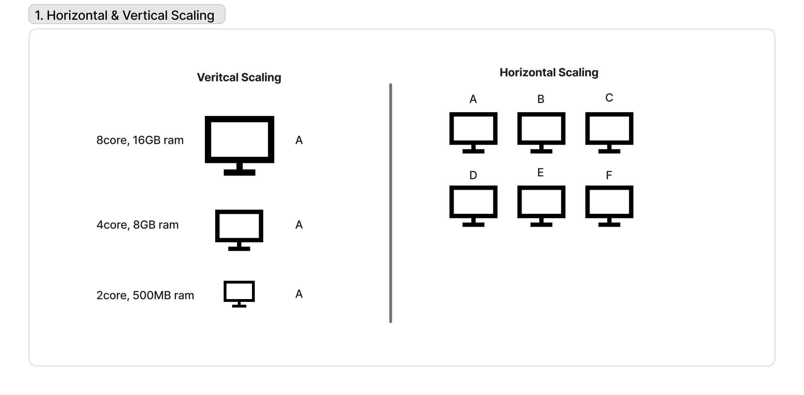

# Horizontal vs Vertical Scaling



## What is Scaling?

Scaling is the process of increasing a system's capacity to handle more traffic, users, or data.

---

## Vertical Scaling (Scale Up)

Vertical scaling means increasing the resources of a single server.

### Example

Upgrade a server from:

- 4 CPU cores → 16 CPU cores
- 8 GB RAM → 64 GB RAM

### Advantages

- Simple to implement
- No major architectural changes required
- Easier to manage

### Disadvantages

- Hardware limits exist
- Can become expensive
- Creates a single point of failure

---

## Horizontal Scaling (Scale Out)

Horizontal scaling means adding more servers to distribute the workload.

### Example

Instead of one server:

```text
1 Server → 4 Servers
```

Traffic is distributed using a load balancer.

### Advantages

- Virtually unlimited growth
- Better fault tolerance
- High availability

### Disadvantages

- More complex architecture
- Requires load balancing
- Data consistency can become challenging

---

## Comparison

| Feature           | Vertical Scaling          | Horizontal Scaling        |
| ----------------- | ------------------------- | ------------------------- |
| Method            | Increase server resources | Add more servers          |
| Complexity        | Low                       | Higher                    |
| Cost              | Can become expensive      | More flexible             |
| Fault Tolerance   | Lower                     | Higher                    |
| Scalability Limit | Hardware limit            | Much higher               |
| Common Use        | Small to medium systems   | Large distributed systems |

---

## Key Takeaway

Vertical scaling makes a single machine more powerful, while horizontal scaling increases capacity by adding more machines. Modern large-scale systems typically rely on horizontal scaling because it provides better availability, fault tolerance, and long-term growth.

## Is this system horizontally or vertically scaled?

- Is there a load balancer? → **Horizontal**
- Multiple identical servers? → **Horizontal**
- Single upgraded machine? → **Vertical**
- Can it survive node failure? → **Horizontal**
