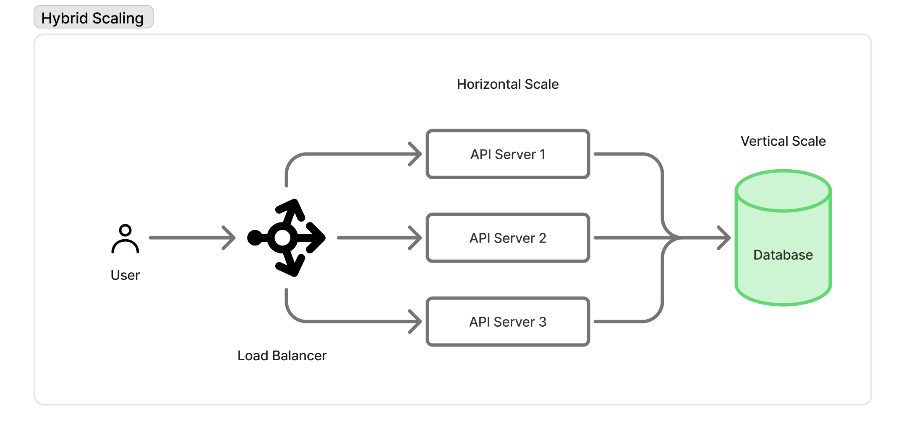

## Hybrid Scaling System?

A hybrid system uses

- **Vertical scaling** → to make individual components more powerful
- **Horizontal scaling** → to distribute load across multiple components

---

## (Core Idea)

Different parts of a system behave differently and have different scaling needs:

| Component    | Scaling Approach                                        |
| ------------ | ------------------------------------------------------- |
| API servers  | Horizontal scaling (traffic distribution)               |
| Database     | Often vertical first, then horizontal (complex scaling) |
| Cache        | Horizontal scaling (distributed cache)                  |
| File storage | Horizontal scaling (distributed storage)                |

👉 Scaling is **layer-specific**, not system-wide.

## Typical scaling

