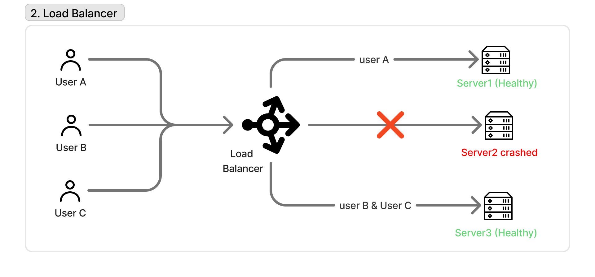
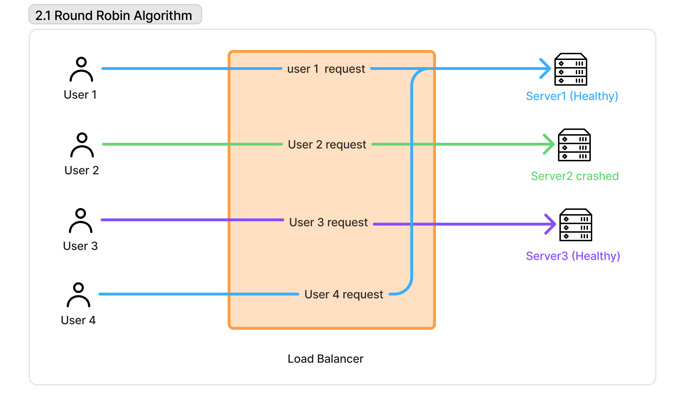
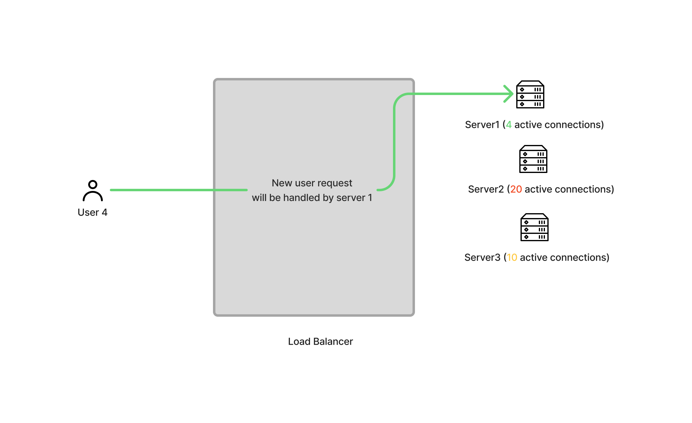
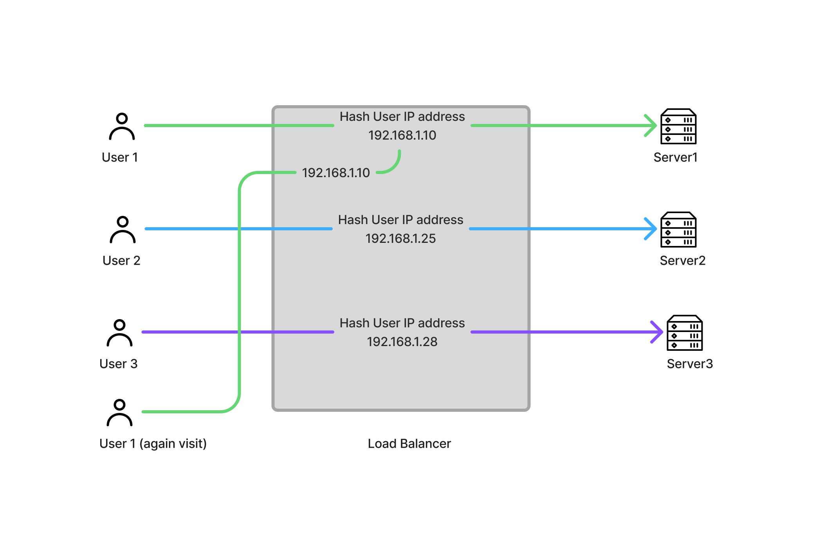

# Load Balancer

A **Load Balancer** is a system that distributes incoming network traffic across multiple backend servers to ensure no single server gets overloaded.

It acts as a **traffic controller between users and servers**.

---

## Why Do We Need a Load Balancer?

Without a load balancer:

- One server handles all requests
- It becomes slow under high traffic
- It may crash due to overload
- System becomes unavailable

With a load balancer:

- Traffic is distributed across multiple servers
- System becomes scalable
- Failure of one server does not break the system
- Performance improves

---

## Basic Architecture

---

## How it works

- User sends a request
- Request hits the load balancer first
  - Load balancer checks:
  - server health
- current load
- It selects an appropriate backend server
- Request is forwarded to that server
- Response is returned back to the user

---

## Load Balancing Algorithms

### 1. Round Robin

Requests are distributed sequentially.

### 2. Least Connections

Request goes to the server with the least active connections.

- Good for uneven workloads
- Efficient resource usage

### 2. Ip Hash

The clients Ip address determines the server

- Good for session persistence

