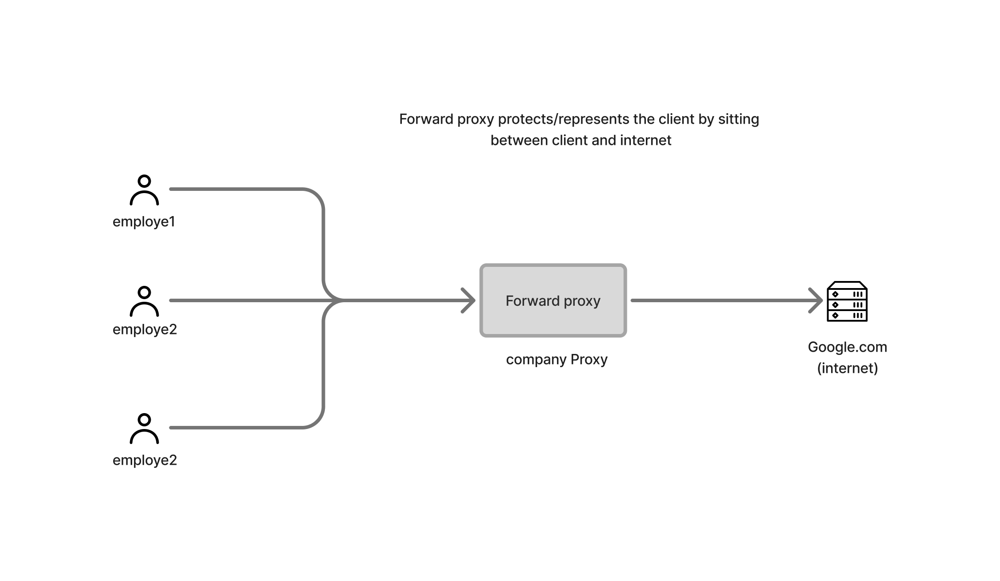

# Forward Proxy

## What is a Forward Proxy?

A forward proxy is a server that sits between clients and the internet.

Instead of connecting directly to a website, the client sends requests to the forward proxy, which then forwards them to the destination server.



The destination server sees the proxy's IP address instead of the client's IP address.

---

## How It Works

1. Client sends a request to the forward proxy.
2. The proxy receives the request.
3. The proxy forwards the request to the target server.
4. The target server responds to the proxy.
5. The proxy returns the response to the client.

```text
Client
   |
   v
Forward Proxy
   |
   v
Website
```

---

## Why Use a Forward Proxy?

### 1. Hide Client Identity

The website sees the proxy's IP address rather than the client's IP address.

```text
Client → Proxy IP → Website
```

---

### 2. Content Filtering

Organizations can block access to specific websites.

```text
Employees
    |
Forward Proxy
    |
Internet
```

Blocked:

```text
facebook.com
youtube.com
```

---

### 3. Monitoring and Logging

All outgoing traffic can be monitored and logged.

---

### 4. Bypass Network Restrictions

Clients may use a proxy to access resources that are otherwise unavailable from their network.

---

### 5. Caching

Frequently requested content can be cached to reduce bandwidth usage.

```text
Client
   |
Forward Proxy Cache
   |
Internet
```

---

## Common Use Cases

- Corporate networks
- Schools and universities
- Internet cafés
- Network monitoring
- Anonymous browsing

---

## Example

Without a proxy:

```text
Client → Google
```

With a forward proxy:

```text
Client → Forward Proxy → Google
```

Google only sees the proxy.

---

## Popular Forward Proxy Software

- Squid
- TinyProxy
- Privoxy

---

## Key Takeaway

> A forward proxy sits in front of clients and forwards requests to the internet on behalf of those clients.
