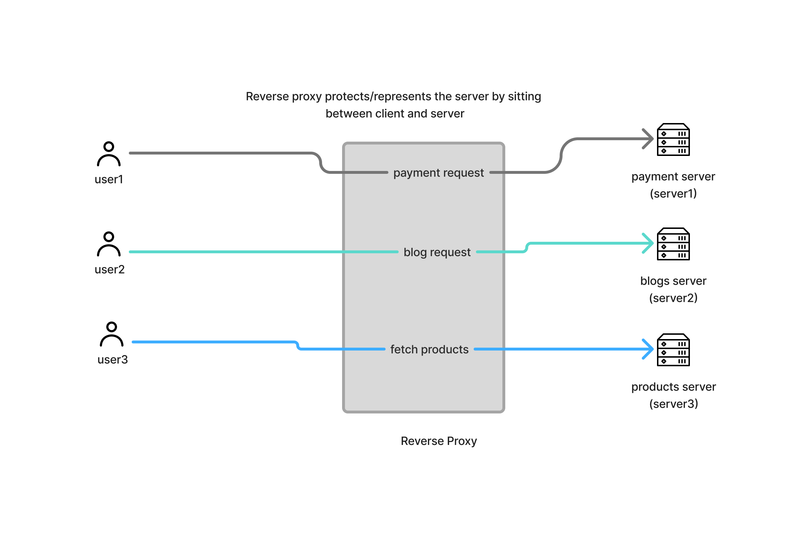

# Reverse Proxy

## What is a Reverse Proxy?

A reverse proxy is a server that sits between users and backend servers.

Instead of users connecting directly to application servers, they connect to the reverse proxy first.



The reverse proxy receives requests, forwards them to the appropriate backend server, and returns the response to the user.

---

## How It Works

1. User sends a request.
2. Reverse proxy receives the request.
3. Reverse proxy selects a backend server.
4. Backend server processes the request.
5. Reverse proxy returns the response to the user.

---

## Why Use a Reverse Proxy?

### 1. SSL/TLS Termination

The reverse proxy handles HTTPS encryption.

```text
HTTPS
User → Reverse Proxy → HTTP → Backend
```

Benefits:

- Reduces application server workload
- Centralizes certificate management

---

### 2. Security

Backend servers are hidden from the internet.

```text
Internet
    |
Reverse Proxy
    |
Internal Servers
```

Benefits:

- Hide internal IP addresses
- Filter malicious traffic
- Integrate with firewalls and WAFs

---

### 3. Load Balancing

Distribute traffic across multiple servers.

```text
              Reverse Proxy
                     |
        +------------+------------+
        |            |            |
     Server 1     Server 2     Server 3
```

Benefits:

- High availability
- Better scalability

---

### 4. Caching

Store frequently requested responses.

```text
User
   |
Reverse Proxy Cache
   |
Backend Server
```

Benefits:

- Faster responses
- Reduced backend load

---

### 5. Request Routing

Route requests to different services.

```text
example.com/api    → API Service
example.com/shop   → Shop Service
example.com/blog   → Blog Service
```

---

## Microservices Example

```text
Client
   |
Nginx
   |
   +--> Auth Service
   +--> User Service
   +--> Product Service
   +--> Payment Service
```

The reverse proxy acts as a single entry point for all services.

---

## Common Reverse Proxy Software

- Nginx
- HAProxy
- Traefik
- Envoy
- Apache HTTP Server

---

## Example

Without a reverse proxy:

```text
User → Application Server
```

With a reverse proxy:

```text
User → Reverse Proxy → Application Server
```

The user never directly accesses the backend server.

---

## Key Takeaway

> A reverse proxy sits in front of servers and forwards client requests to backend services on behalf of those servers.
